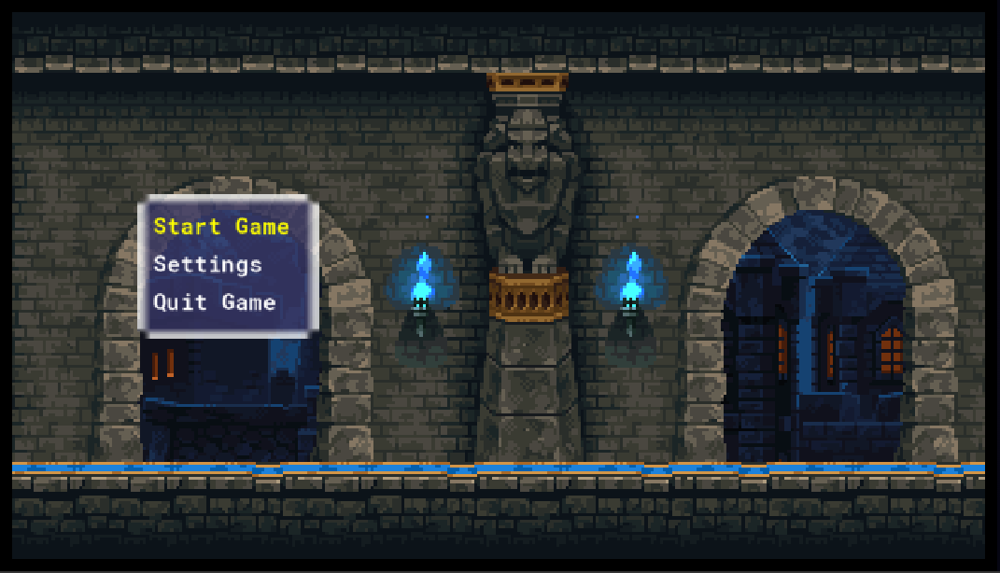

# Game Development Project

This project is a game developed using GameMaker Studio 2. It involves a grid-based environment, pathfinding algorithms, and random cell selection scripts.

## Table of Contents

- [Features](#features)
- [Getting Started](#getting-started)
- [Usage](#usage)
- [Contributing](#contributing)
- [License](#license)

## Features

- Grid-based environment for entity movement.
- Implementation of the A* algorithm for efficient pathfinding.
- Random cell selection script using a randomized search algorithm.

## Getting Started

To run this project locally, follow these steps:

1. Clone this repository to your local machine.
2. Open the project in GameMaker Studio 2.
3. Run the game using the appropriate settings in GameMaker.

## Usage

- The game can be played using the GameMaker Studio 2 environment.
- Customize the grid size, environment, and entities as needed for your specific game.

## Contributing

Contributions are welcome! Please follow these steps:

1. Fork the repository.
2. Create a new branch for your feature: `git checkout -b feature-name`.
3. Make your changes and commit them: `git commit -m 'Add some feature'`.
4. Push to the branch: `git push origin feature-name`.
5. Create a new pull request.

## License

This project is licensed under the [MIT License](LICENSE).

## Screenshot 

